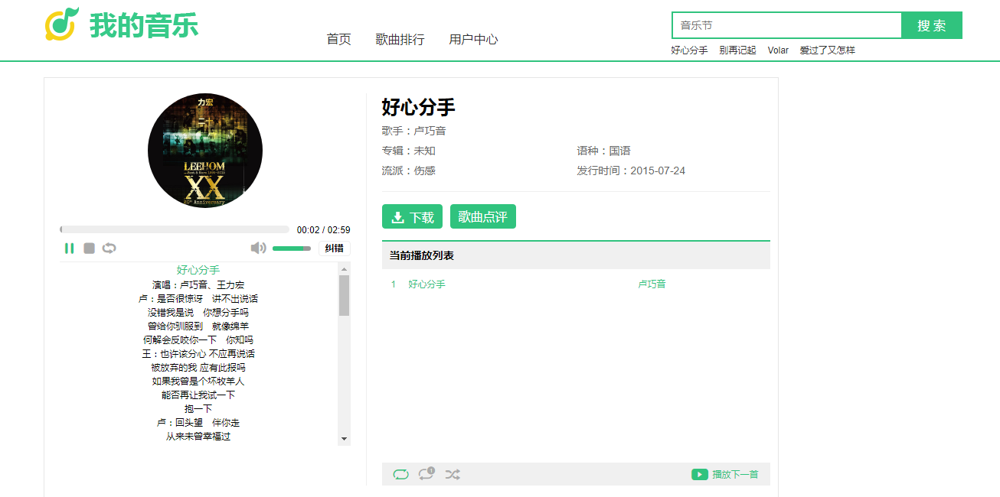
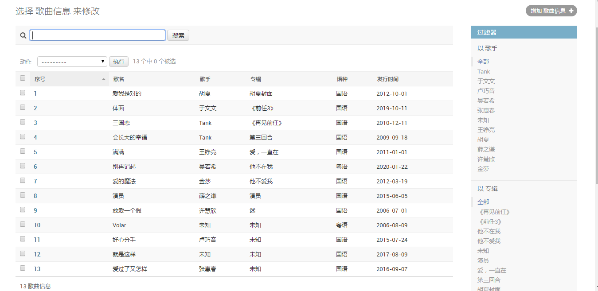

# 在线音乐网站

基于《玩转Django2.0》书中的例子学习。

分支介绍：

master : 书中例子

dev ： 添加根据标签查找音乐

dev2 ： 讲项目部署到阿里云服务器上（uWSGI + Nginx + Ubuntu）

网站展示：

**首页：**

**播放页：**

后台：

参考：

- 《玩转Django2.0》（黄永祥）
- <https://www.cnblogs.com/zhaop8078/p/11616479.html>
- <https://github.com/firehanh/music>

