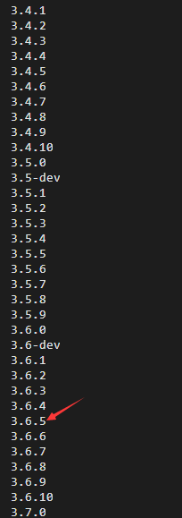
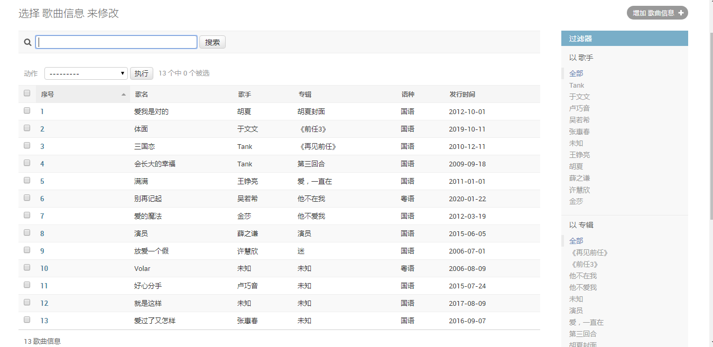
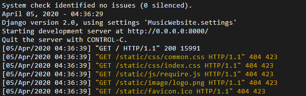
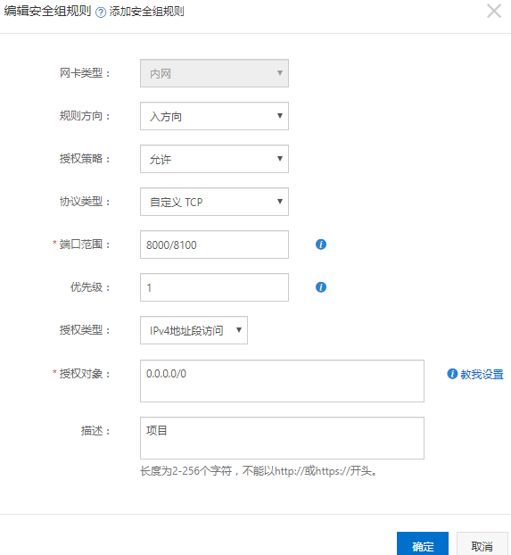
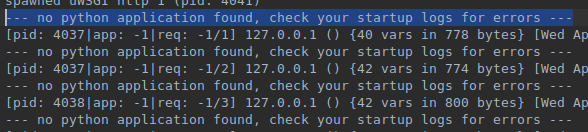

# uWSGI +Nginx + 阿里云ECS服务器 Ubuntu 16.04  Django项目部署

连接上服务器后，我直接使用的是root账号

#### 使用pyenv管理python版本

```python
#首先对系统环境进行一下更新，确保后面的操作不会因为缺少某个工具导致失败

sudo apt-get update

#安装curl，git

sudo apt-get install curl git-core

#安装pyenv

curl -L https://raw.github.com/yyuu/pyenv-installer/master/bin/pyenv-installer | bash

#这个命令会把pyenv安装到当前用户的~/.pyenv目录下.（本文中为/home/root/.pyenv）

#同样，在用户目录下找到.bashrc文件，将下面的代码添加至文件内容末尾(本文中bashrc文件路径在/home/breavo下，可自行对应到自己的路径)

export PYENV_ROOT="${HOME}/.pyenv"

if [ -d "${PYENV_ROOT}" ]; then
  export PATH="${PYENV_ROOT}/bin:${PATH}"
  eval "$(pyenv init -)"
fi

#修改后保存~

#这段代码的作用主要是指明pyenv的位置，以便以后可以直接在命令行里面运行pyenv命令。 保存在~/.bashrc 文件中是为了每次用户登陆后自动生效。

#所以如果你是第一次运行命令并且没有注销的话， 这一段是不会生效的， 我们还需要运行下面的命令令其生效
source ~/.bashrc
```

#### Python安装

```
# 查看可版本
pyenv install --list
```



```python
pyenv install 3.6.5 -v
# 众所周知的原因，这个安装很慢,所以我在网上首先下载好了Python-3.6.5.tar.xz
```

需要将本地电脑上的Python-3.6.5.tar.xz传到阿里云上，安装putty后 （安装简单，下一步）在cmd中执行以下命令，传到/root/.pyenv/cache文件夹中（可能需要手动穿点cache文件夹）

```
pscp  C:\Users\lenovo\Desktop\Python-3.6.5.tar.xz   root@IP:/root/.pyenv/cache
```

顺利获得Python-3.6.5.tar.xz后依旧会暗转失败，需要安装一些Python依赖包

```python
sudo apt-get install make build-essential libssl-dev zlib1g-dev
sudo apt-get install libbz2-dev libreadline-dev libsqlite3-dev wget
sudo apt-get install llvm libncurses5-dev libncursesw5-dev
```

继续运行

```
pyenv install 3.6.5 
```

python3.6.5安装成功。

#### [pyenv基本操作](<https://www.cnblogs.com/louyefeng/p/12031272.html>)

```
pyenv versions # 查看已安装版本
```


```python

pyenv gloabl 3.6.5 # 切换默认的Python环境
pyenv uninstall x.x.x # 卸载

pyenv shell xxx（xxx为python版本号或者虚拟环境名称）切换环境

激活/退出虚拟环境
pyenv activate eshop
pyenv deactivate
```

**创建虚拟环境Music**

```
pyenv virtualenv 3.6.5 music
```

**虚拟环境搭建完成**

#### Nginx基本配置

```
# 安装Nginx
sudo apt-get install nginx

# 运行
sudo /etc/init.d/nginx start 
```

访问云服务器地址，出现如下图Nginx配置成功



#### Mysql安装

```mysql
首先执行下面三条命令：

sudo apt-get install mysql-server
sudo apt install mysql-client
sudo apt install libmysqlclient-dev

#安装成功后可以通过下面的命令测试是否安装成功：
sudo netstat -tap | grep mysql

#可以通过如下命令进入mysql服务：
mysql -u root -p password
```

我的项目使用的是MySQL，数据库我已经导出来并上传到服务器，接着创建表并将数据导入。

```
create database music_db;

user music_db;

# 导入源数据
source x/x/x.sql
```


在Music的虚拟环境下安装项目所需要的依赖，有requirements.txt文件的话(pip install -r requirements.txt)

```
pip install mysqlclient
pip install Django==2.0
pip install uwsgi
```

使用putty同样的方法将本地项目传到云服务器/home文件夹下，并修改数据库的连接信息和静态资源路径

```
DATABASES = {
    'default': {
        'ENGINE': 'django.db.backends.mysql',
        'NAME': 'music_db',
        'USER':'root',
        'PASSWORD':'****',
        'HOST':'127.0.0.1',
        'PORT':'3306',
    }
}

# STATIC_ROOT设置项目上线后的使用的静态资源
STATIC_URL = '/static/'
STATIC_ROOT = 'static/'

# 第一次配置路径时提示不要配置STATICFILES_DIRS，注释后运行没错
#STATICFILES_DIRS = [
# os.path.join(BASE_DIR, "static"),
# ]


```

如果出现如下信息则是静态资源配置错误



#### 测试uwsgi服务

```
# /home/项目名是项目的绝对路径
# 项目名.wsgi  Django项目里的uwsgi文件
uwsgi --http :8000 --chdir /home/项目名 -w 项目名.wsgi
```

 访问 云服务器地址 x.x.x.x:8000出现项目首页配置成功

有时会出现如下问题


解决办法：<https://blog.csdn.net/zhangyu4863/article/details/81037741>

在源代码settings.py修改

```
#ALLOWED_HOSTS = ['0.0.0.0']
ALLOWED_HOSTS = ['112.74.177.117', 'localhost', '0.0.0.0:8000', '127.0.0.1']


# 使用下面代码启动项目
python manage.py runserver 0.0.0.0:8000
```

也可能需要去云服务器控制台添加端口信息：




 uwsgi测试成功后，为其编写uWSGI配置文件

#### 在项目根目录下创建music_uwsgi.ini文件

```
[uwsgi]
# Django-related settings
socket= :8000

# the base directory (full path)
chdir=/home/项目名

# Django wsgi file
module=MusicWebsite.wsgi

# process-related settings
# master
master=true

# maximum number of worker process
processes=4

# ...with appropriate permissions - may be need
# chmod-socket = 664
# clear environment on exit
vacuum=true

```


使用如下指令 用配置文件启动uwsgi服务

```
uwsgi --ini music_uwsgi.ini & # 加上&表示在后台运行
```


#### Nginx+uWSGI部署项目

修改Nginx的配置文件 /etc/nginx/nginx.conf

```
user www-data;
worker_processes auto;
pid /run/nginx.pid;

events {
	worker_connections 768;
	# multi_accept on;
}

http {

    # 省略以上代码
    # new add 新增
    server{
        listen 8001; # Nginx和uWSGI通信的端口为8000，8000不能再用，所以画面一个
        server_name www.baidu.com # 一般为 www.xxx.com,如果是localhost或127.0.0.1只能本机访问
        charset UTF-8;
        access_log  /var/log/nginx/myweb_access.log;
        error_log   /var/log/nginx/myweb_error.log;

        client_max_body_size 75M;
        # lian jie uwsgi server ，端口 8000；
        # 以下配置要与uWSGI的配置相同
        location /{
            include uwsgi_params;
            uwsgi_pass 127.0.0.1:8000;
            uwsgi_read_timeout 2;
        }
        # static file
        location /static{
            expires 30d;
            autoindex on;
            add_header Cache-Control private;
            alias /home/OnlineMusicWebsite/static;
        }
    }
}
```

配置完成后

重新启动Nginx和uWSGI服务，访问 x.x.x.x:8001可以看见运行的项目

```
# 运行Nginx
sudo /etc/init.d/nginx start 

# 运行uWSGI
uwsgi --ini music_uwsgi.ini & # 加上&表示在后台运行

```


遇到 “--- no python application found, check your startup logs for errors”问题时一定要好好检查Nginx和uWSGI的配置文件看看是否有错误。




参考：

主要参考：[Ubuntu下的Nginx + Uwsgi + Django项目部署详细流程 ](https://blog.csdn.net/breavo_raw/article/details/82665978> ) （上面文章有一大部分出自这里）和 《玩转Django2.0》第十二章

<https://blog.csdn.net/zhangyu4863/article/details/81037741>

<https://blog.csdn.net/yilovexing/article/details/82969103>